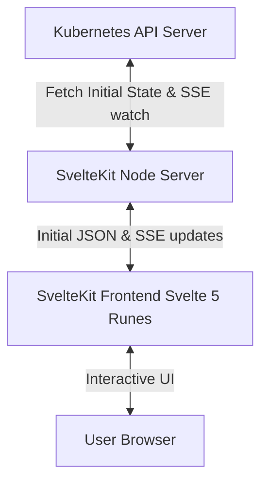

# Kube Resource View - Developer Agent Guide (AGENTS.md)

This document serves as a complete architectural guide and reference for AI agents and developers working on the **Kube Resource View** repository.

---

## 1. Project Overview

**Kube Resource View** is a real-time cluster visualization dashboard built with SvelteKit and Svelte 5 (Runes). It monitors and displays resource usage (CPU & Memory actual consumption), resource requests, and resource limits for every node and pod in a Kubernetes cluster.

The application is fully **highly available (HA)** and **stateless** on the backend. All active cluster state is managed in the user's browser, allowing you to run multiple replicas of the backend server behind a standard load balancer.

---

## 2. Core Architecture & High Availability (HA)



### High Availability (HA)
- **Stateless Backend**: The SvelteKit backend server is completely stateless. It does not cache cluster resources in memory or maintain user-session sticky states.
- **Scalability**: You can scale the backend deployment to **2, 3, or more pods** behind a Kubernetes Service or Load Balancer. Initial load requests and long-running Server-Sent Events (SSE) watch streams can be distributed arbitrarily across replicas.
- **Browser-Side State**: State is kept in-memory on the client via Svelte 5 runes (`$state`). When a connection drops or points to a different backend replica, the frontend cleanly re-hydrates.

### Data Synchronization Flow
1. **Initial Load**: SvelteKit's `load` function fetches the current nodes, pods, and metrics from the K8s API server on the backend, returning them as initial data for instant server-side / client-side hydration.
2. **Real-time Stream**: Immediately after page render, the client opens a Server-Sent Events (SSE) stream to `/api/k8s/stream`.
3. **SSE updates**: The backend watches node and pod resource events and polls the K8s Metrics Server (`metrics.k8s.io`) every 10 seconds, pushing updates (`ADD`, `UPDATE`, `DELETE`, `METRICS`) to the client.

---

## 3. Repository Structure

```
kube-resource-view/
├── k8s/                       # Kubernetes deployment manifests
├── src/
│   ├── lib/
│   │   ├── components/        # Svelte UI Components
│   │   │   ├── ClusterHeader.svelte    # Header stats & aggregated cluster usage
│   │   │   ├── ControlsBar.svelte      # Bottom filter, search, & toggle controls
│   │   │   ├── NodeCard.svelte         # Individual node layout & resource gauges
│   │   │   ├── PodBlock.svelte         # Grid/list representation of individual pods
│   │   │   ├── PodTooltip.svelte       # Floating hover tooltip
│   │   │   └── ResourceGauge.svelte    # Custom CPU/MEM utilization bar
│   │   ├── k8sStore.svelte.ts # Svelte 5 state store (syncs SSE, manages global tooltips)
│   │   ├── types.ts           # Typescript interfaces for K8s objects & SSE payloads
│   │   └── utils.ts           # Helper functions (byte formatting, status coloring)
│   └── routes/
│       ├── api/k8s/stream/    # Server-Sent Events endpoint
│       │   └── +server.ts
│       ├── +page.server.ts    # Initial SSR / load data fetching
│       ├── +page.svelte       # Layout container & global tooltip renderer
│       └── layout.css         # Base stylesheet & dark mode variables
├── package.json
└── tsconfig.json
```

---

## 4. Development & Verification Guide

### Run Locally
To run the SvelteKit development server locally:
```bash
npm install
npm run dev
```
By default, the server will read your local kubeconfig (`~/.kube/config`). Ensure your Kubernetes context is active (e.g. `kubectl config current-context`).

### Validation
Always run the validation script before committing code edits:
```bash
npm run check
```

### Build & Docker
To verify production bundle builds and build production container images:
```bash
# Verify svelte production build
npm run build

# Build production docker image
docker build --target production -t kube-resource-view:latest .
```
